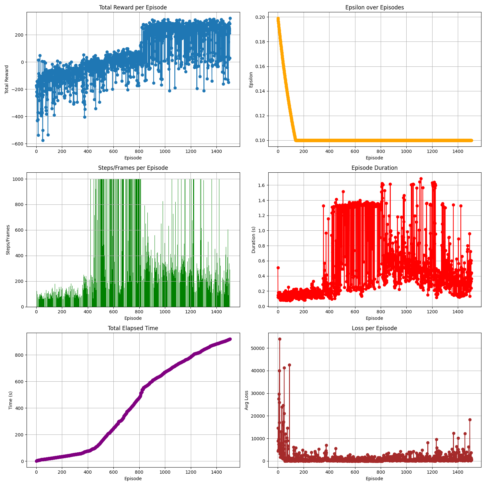

# LunarLander PPO

This repository implements Proximal Policy Optimization (PPO) for `LunarLander-v3` using Gymnasium + PyTorch.

- Training entry: `python scripts/train.py --config configs/default.yaml`
- Evaluation: `python scripts/evaluate.py --config configs/default.yaml --checkpoint <path>`
- Video: `python scripts/record_video.py --config configs/default.yaml --checkpoint <path>`
- Sweep: `python scripts/sweep.py --sweep configs/sweep.yaml`

A practical implementation of **Proximal Policy Optimization (PPO)** using an **Actor-Critic** network to solve **`LunarLander-v3`**.  
It trains from scratch, logs metrics, saves checkpoints, generates plots, and can record rollout videos.

---

## Project Structure

```text
lunarlander-ppo/
├─ configs/            # YAML configs (default/best/sweep)
├─ src/                # package source (agent/env/training/logging/utils)
├─ scripts/            # CLI entrypoints (train/evaluate/sweep/record_video)
├─ experiments/        # run outputs (models/plots/logs) - not committed
├─ assets/
│  ├─ figures/         # README images
│  └─ videos/          # README videos
└─ tests/              # basic correctness + smoke tests
```

---

## Installation

```bash
pip install -r requirements.txt
```

> Note: `gymnasium[box2d]` pulls Box2D dependencies. If your machine complains, it’s usually missing system build tools.

---

## Quick Start

### Train (single run)
```bash
python scripts/train.py --config configs/default.yaml
```

Outputs go into a timestamped folder under `experiments/`:
- `train_metrics.csv` and `train_metrics.jsonl`
- `models/` (best/latest/final checkpoints)
- `plots/` (reward, loss, entropy, steps, elapsed time, eval curves)

### Evaluate a saved checkpoint
```bash
python scripts/evaluate.py \
  --config configs/default.yaml \
  --checkpoint experiments/<run>/models/best_model.pth \
  --episodes 20 \
  --deterministic
```

### Record a rollout video
```bash
python scripts/record_video.py \
  --config configs/default.yaml \
  --checkpoint experiments/<run>/models/best_model.pth \
  --out_dir assets/videos
```

### Run a grid sweep
```bash
python scripts/sweep.py --sweep configs/sweep.yaml
```

---

# LunarLander Environment

`LunarLander-v3` is a classic discrete-action control environment with:

- Observation: 8-dimensional continuous state
- Actions: 4 discrete thrusters
- Reward shaping that encourages stable landing and penalizes fuel waste

See Gymnasium docs for full detail.

---

# PPO Notes

This implementation uses an Actor-Critic model and the PPO clipped surrogate objective:

- Policy loss: `min(r_t * A_t, clip(r_t, 1-ε, 1+ε) * A_t)`
- Value loss: MSE between predicted value and return
- Entropy bonus encourages exploration

Advantages are computed with GAE(λ), then normalized for stability.

---

## Hyperparameter Sweep (20 Setups)

The following table documents the hyperparameter configurations used in experimentation:

| Setup # | Learning Rate | Gamma | Clip Epsilon | Update Epochs | Mini-Batch Size | Entropy Coef | Value Loss Coef | Hidden Dim | Max Timesteps | Eps Decay | Min Clip Epsilon |
|:------:|:------------:|:-----:|:------------:|:-------------:|:---------------:|:------------:|:---------------:|:----------:|:------------:|:--------:|:---------------:|
| 1  | 3e-4 | 0.99  | 0.2  | 4  | 64  | 0.01  | 0.5 | 128 | 1000 | 0.995 | 0.1  |
| 2  | 3e-4 | 0.99  | 0.2  | 4  | 64  | 0.02  | 0.5 | 128 | 1000 | 0.995 | 0.1  |
| 3  | 3e-4 | 0.99  | 0.2  | 8  | 64  | 0.01  | 0.5 | 128 | 1000 | 0.995 | 0.1  |
| 4  | 1e-3 | 0.99  | 0.2  | 4  | 64  | 0.01  | 0.5 | 128 | 1000 | 0.995 | 0.1  |
| 5  | 3e-4 | 0.99  | 0.3  | 4  | 64  | 0.01  | 0.5 | 128 | 1000 | 0.995 | 0.1  |
| 6  | 3e-4 | 0.99  | 0.2  | 4  | 128 | 0.01  | 0.5 | 128 | 1000 | 0.995 | 0.1  |
| 7  | 3e-4 | 0.99  | 0.2  | 4  | 64  | 0.01  | 0.7 | 128 | 1000 | 0.995 | 0.1  |
| 8  | 3e-4 | 0.99  | 0.2  | 4  | 64  | 0.01  | 0.5 | 128 | 1000 | 0.99  | 0.1  |
| 9  | 3e-4 | 0.99  | 0.1  | 4  | 64  | 0.01  | 0.5 | 128 | 1000 | 0.995 | 0.05 |
| 10 | 3e-4 | 0.99  | 0.2  | 4  | 64  | 0.005 | 0.5 | 128 | 1000 | 0.995 | 0.1  |
| 11 | 3e-4 | 0.995 | 0.2  | 4  | 64  | 0.01  | 0.5 | 128 | 1000 | 0.995 | 0.1  |
| 12 | 5e-4 | 0.99  | 0.2  | 4  | 64  | 0.01  | 0.5 | 128 | 1000 | 0.995 | 0.1  |
| 13 | 3e-4 | 0.99  | 0.2  | 6  | 64  | 0.01  | 0.5 | 128 | 1000 | 0.995 | 0.1  |
| 14 | 3e-4 | 0.99  | 0.2  | 4  | 32  | 0.01  | 0.5 | 128 | 1000 | 0.995 | 0.1  |
| 15 | 3e-4 | 0.99  | 0.2  | 4  | 64  | 0.015 | 0.4 | 128 | 1000 | 0.995 | 0.1  |
| 16 | 3e-4 | 0.99  | 0.25 | 4  | 64  | 0.01  | 0.5 | 128 | 1000 | 0.995 | 0.1  |
| 17 | 3e-4 | 0.99  | 0.2  | 4  | 64  | 0.01  | 0.5 | 128 | 1000 | 0.997 | 0.1  |
| 18 | 3e-4 | 0.99  | 0.2  | 4  | 64  | 0.01  | 0.5 | 256 | 1000 | 0.995 | 0.1  |
| 19 | 3e-4 | 0.98  | 0.2  | 4  | 64  | 0.01  | 0.5 | 128 | 1000 | 0.995 | 0.1  |
| 20 | 3e-4 | 0.99  | 0.2  | 10 | 32  | 0.01  | 0.5 | 128 | 1000 | 0.995 | 0.1  |

---

## Best Performing Model

This configuration is the selected “best” setup used for the longer training run:

| Parameter | Value |
|---|---|
| env_name | LunarLander-v3 |
| max_episodes | 10000 |
| learning_rate | 0.0003 |
| gamma | 0.99 |
| clip_epsilon | 0.2 |
| update_epochs | 4 |
| mini_batch_size | 64 |
| entropy_coef | 0.005 |
| value_loss_coef | 0.5 |
| hidden_dim | 128 |
| max_timesteps | 1000 |
| eps_decay | 0.995 |
| min_clip_epsilon | 0.1 |

### Best Model Outputs

**Training plots** (best run snapshot):



**Policy rollout video** (best model):

https://github.com/<YOUR_USERNAME>/<YOUR_REPO>/raw/main/assets/videos/video.mp4

> GitHub README rendering does not reliably embed MP4 as an inline player everywhere. The link above is the simplest “it works” option.
> If you want inline playback, convert it to a GIF and embed it, or use GitHub Pages.

---

## Testing

```bash
pytest -q
```

---

## License

MIT.
